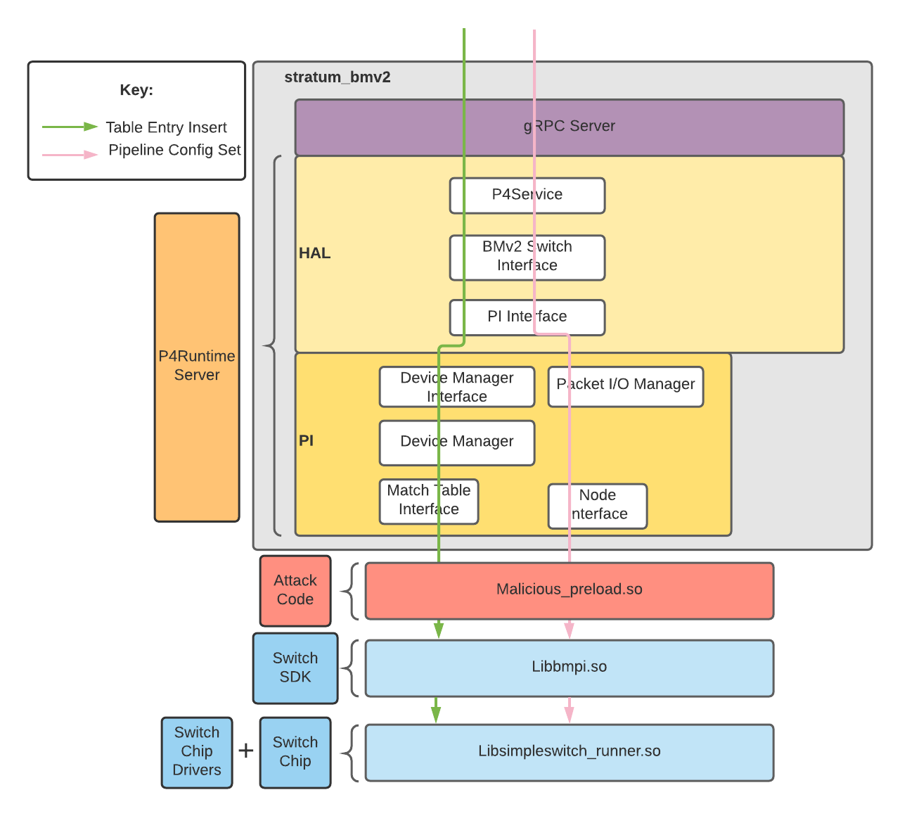
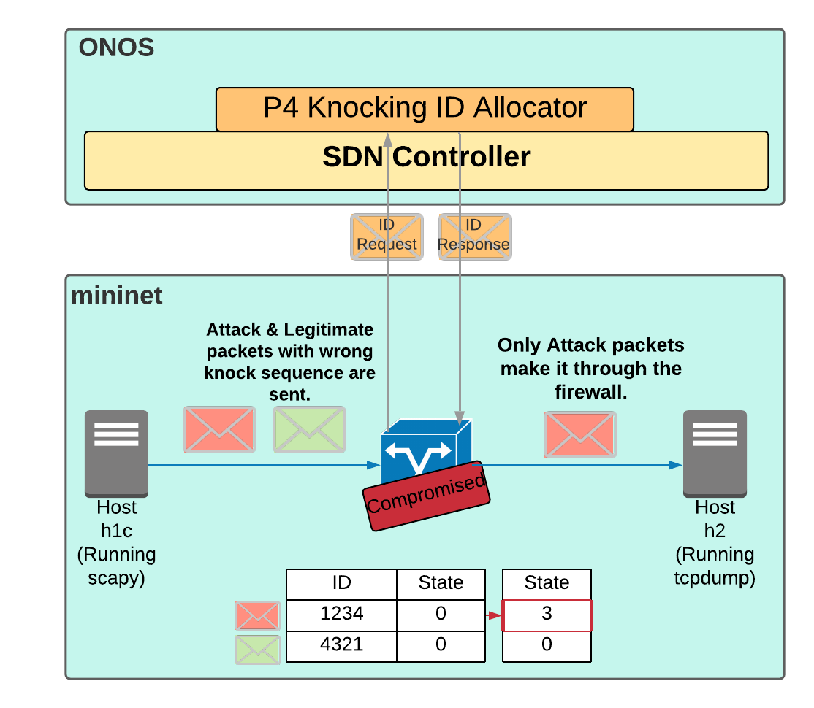

# Adversarial Exploitation of P4 Data Planes

## Introduction

This repository contains the code required to implement the stateful firewall bypass attacks outlined in our paper Adversarial Exploitation of P4 Data Planes, presented at IM 2021. This repository builds upon the materials provided in the [Next-Gen SDN Tutorial](https://github.com/opennetworkinglab/ngsdn-tutorial), with all modifications detailed below. The original README can be viewed at [README-ngsdn-tutorial](README-ngsdn-tutorial.md).

### Citing

```bibtex
@INPROCEEDINGS{cbssh:AdvExpP4DP,
    author       = "{Conor Black and Sandra Scott-Hayward}",
    title        = "{Adversarial Exploitation of P4 Data Planes}",
    booktitle    = "{2021 IFIP/IEEE Symposium on Integrated Network and Service Management (IM)}",
    location     = "Bordeaux, France",
    days         = 17-21,
    month        = May,
    year         = 2021
}
```


## Overview

### Testbed Overview

The purpose of this work is to demonstrate how an attacker with the ability to run code on a P4 switch can successfully alter the switch's stateful forwarding behaviour without detection. To do this, we take the testbed provided by the Next-Gen SDN Tutorial virtual machine and augment it by modifying the original P4 program to include a stateful firewall component and by injecting our attack code to run within the software switches.

The Next-Gen SDN Tutorial testbed consists of two Docker containers: one running the [ONOS](https://github.com/opennetworkinglab/onos) SDN controller and another running a mininet of [BMv2](https://github.com/p4lang/behavioral-model) P4 software switches, arranged in the topology depicted in [topo-v6](img/topo-v6.png). Each BMv2 switch runs as an executable called `stratum_bmv2`, which implements the [PI](https://github.com/p4lang/PI) P4Runtime Server and communicates with the ONOS controller using the P4Runtime protocol. The actual switch forwarding behaviour is implemented by two shared libraries: `libbmpi.so` and `libsimpleswitch_runner.so`, which are dynamically loaded by `stratum_bmv2`. 

Our attacks take advantage of this setup by running within a shared library, which is loaded before all other shared libraries using the [LD_PRELOAD trick](https://rafalcieslak.wordpress.com/2013/04/02/dynamic-linker-tricks-using-ld_preload-to-cheat-inject-features-and-investigate-programs/). This allows us to use our attack shared library to manipulate data that is passed between `stratum_bmv2` and the `libbmpi.so` and `libsimpleswitch_runner.so` shared libraries to achieve the goals of our attack. This setup is shown in the diagram below.

<p align="center">
  
</p>

### Attack Overview

In order to test the effectiveness of our attack code in launching stateful attacks without detection, we implemented a simple version of the [P4Knocking](https://github.com/ederollora/NETPROC_P4Knocking) stateful firewall application, which allows TCP packets to bypass the firewall only if the source IP address first sends the correct sequence of knock packets. This allowed us to define a simple attack goal: to allow packets from an 'attacker's' IP address to bypass the firewall without first following the knock sequence. To achieve this, we demonstrate two separate attacks:

1. A **Program Change Attack** where the attacker swaps the legitimate P4 program for a modified version that includes an additional match-action table. This table can contain attacker-inserted IP addresses, which are automatically granted firewall bypass.
1. A **Table Entry Attack** where the attacker allows the legitimate program to run but manipulates values in an existing match-action table that gives the attacker's IP address the same firewall bypass rights as a legitimate IP address that has followed the knock sequence correctly.

For each attack, two versions of the code are included: one where the attack is successful and another where the attack is unsuccessful. 

More detailed information about both attacks can be found in their respective README files: [Table Entry README](attacks/table-entry-attack/README.md) and [Program Change README](attacks/program-change-attack/README.md). The figure below provides an overview of the attack scenario.

<p align="center">
  
</p>

### Repository Structure

Our repository has used the Next-Gen SDN Tutorial repository as its basis, but we have modified that repository in the following ways:

* The [solutions](https://github.com/opennetworkinglab/ngsdn-tutorial/tree/advanced/solution) to all Next-Gen SDN Tutorial exercises have been used in place of the incomplete files used in the exercises to ensure that the application runs correctly. The original solutions and exercises were deleted to avoid confusion.
* [P4KnockingComponent.java](app/src/main/java/org/onosproject/ngsdn/tutorial/P4KnockingComponent.java) was added to the application. This is a simple implmentation of the [P4Knocking](https://github.com/ederollora/NETPROC_P4Knocking) controller functionality that receives packets from the data plane and allocates a new ID for each new source IP address.
* The [main.p4](p4src/main.p4) program was edited to include the P4Knocking functionality. All original functionality was retained.
* The [Docker compose](docker-compose.yml) file was edited to cause the attack code to be loaded into the mininet Docker container at runtime.
* The attack code was added to the [attacks](attacks) folder.


## Getting Started

Full instructions on how to set up the virtual machine and run the attack code can be found in [INSTALL](INSTALL.md).


## Contributors

* Conor Black
* Sandra Scott-Hayward

To get in contact about the project, please email Conor at cblack39@qub.ac.uk.
